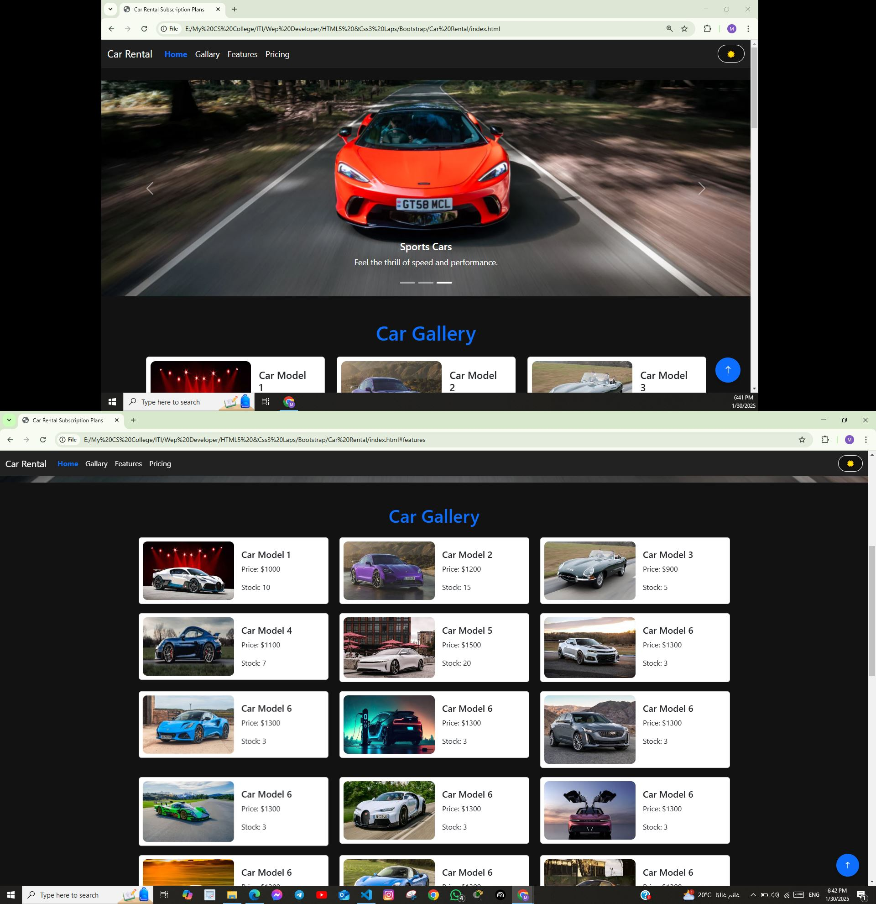
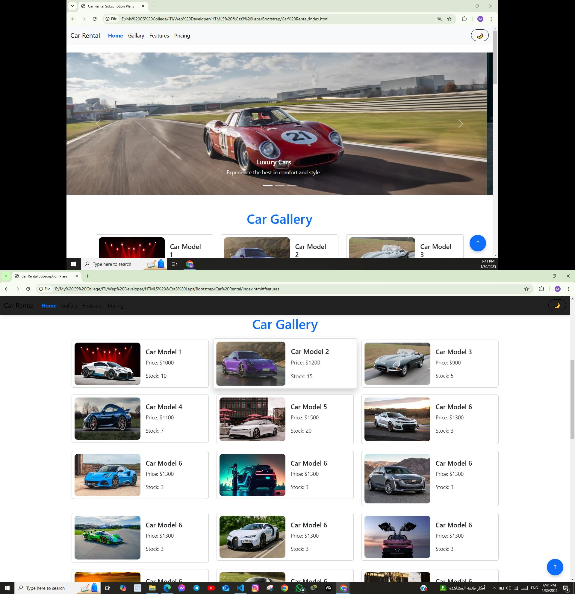

## 🚀 Live Demo
🔗 [View Live Demo](#) 

<h1 align="center">🚗 Car Rental Website</h1>
<p align="center">
  A modern and responsive car rental website with dark mode support, interactive UI, and a smooth user experience.
</p>

## 🌟 Features

- 🔹 **Dark Mode**: Toggle between light and dark mode for a better user experience.
- 🔹 **Responsive Design**: Fully optimized for all screen sizes (mobile, tablet, and desktop).
- 🔹 **Interactive UI**: Smooth animations and hover effects for a modern feel.
- 🔹 **Car Listing**: Beautifully designed car cards with images and descriptions.
- 🔹 **Pricing Plans**: Attractive pricing cards with hover effects.
- 🔹 **Fixed Navbar**: Responsive navigation bar with smooth scrolling.
- 🔹 **Preloader**: A simple loading spinner before the page loads completely.
- 🔹 **Floating Action Button**: Quick access button for enhanced usability.
- 🔹 **Footer Links**: Useful links and contact information in the footer.

## 🛠️ Technologies Used

- HTML5
- CSS3
- JavaScript
- Bootstrap

## 📂 Project Structure

```
📁 Car-Rental-Website
│── 📄 index.html      # Main page
│── 📄 styles.css      # Custom styling
│── 📄 script.js       # JavaScript functionalities
│── 📁 img             # Images and other resources
```

## 🎨 UI Components

### 🔸 Navbar
A responsive navigation bar that adapts to different screen sizes and includes a toggle button.

### 🔸 Car Cards
Beautifully designed car listings with hover effects and smooth transitions.

### 🔸 Pricing Section
Eye-catching pricing cards with hover animations to enhance user engagement.

### 🔸 Dark Mode
Users can switch between light and dark themes seamlessly.

### 🔸 Preloader
A simple loading animation to enhance the user experience.


## 📸 Screenshots

| Dark Mode | Light Mode  |
|------------|-----------|
|  |  |

## 📌 How to Use

1. Clone the repository:
   ```sh
   git clone https://github.com/MahmoudEissaM/car-rental-website.git
   ```
2. Open `index.html` in your browser.
3. Enjoy the seamless car rental experience!

## 📝 License
This project is open-source and available under the [Eng - Mahmoud Eissa](LICENSE).
